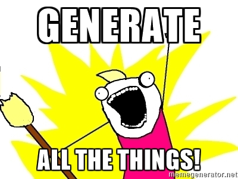

# JHipster Generator



# JHipster - about
- based on Yaoman
- Spring boot + AngularJS app generator
- scaffolds Web Application basics
- https://github.com/jhipster/generator-jhipster

# Generated application
- Bower, Gulp , Maven
- Spring boot
- Spring Security
- Tests
- Tries to used "best practices"

# Persistence layer design
- via cli interactively
- JH Studion and import

# Demo
- generate simple webapp
```
 $ yo jhipster
 $ \.mvnv
 $ yo jhipster:import-jdl demo.jh

```